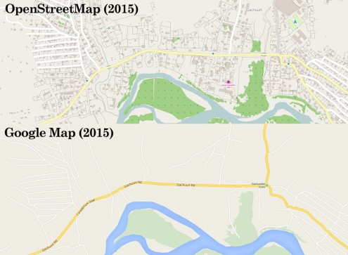

#Project 3: Ulaanbaatar OpenStreetMap Data Wrangling with MongoDB
In this project, I use data munging techniques, such as assessing the quality of the data for validity, accuracy, completeness, consistency and uniformity, to clean OpenStreetMap data for [Ulaanbaatar](https://en.wikipedia.org/wiki/Ulan_Bator), capital of Mongolia.


**Dataset:** [Mapzen metro extract XML](https://s3.amazonaws.com/metro-extracts.mapzen.com/ulaanbaatar_mongolia.osm.bz2)

##1. Data audit
Before converting the OpenStreetMap XML into JSON format for inport into MongoDB, I audited the data for incosistencies and other problematic data. Below are some of the issues I came across, and the solutions I resorted to.

###Street name inconsistencies
The dataset presented a number of inconsistencies in names of strets and other thoroughfares:
* Abbreviations
  * Sq > Square
* Lowecase
  * street > Street
* Mongolian names
  * Zam > Road
  * Toiruu > Ring Road
* Space omission
  * PeaceAvenue > Peace Avenue

These were corrected using the following replacement map:
```
{
    "Sq": "Square",
    "Zam": "Road",
    "Toiruu": "Ring Road",
    "toiruu": "Ring Road",
    "PeaceAvenue": "Peace Avenue",
}
```

Then converted into title case with `name = name.title()`.

The United Nations Street mistakenly included the name of the district, which was corrected using the following replacement map:

```
{
"UN Street, Sukhbaatar District" : "United Nations Street",
"UN Street-16, Sukhbaatar District" : "United Nations Street"
}
```

Finally, some `addr:street` fields were mistakenly used for duureg and khoroo, administrative divisions of the Mongolian capital. The invalid tags have been omitted.

###Invalid postal codes
Valid Ulaanbaatar postal codes fall within the 11xxx-19xxx range. The audit of OpenStreetMap data found that many contributors mistakenly input the city's telephone country code (+976) in the postal code field instead.

These and other invalid postal codes were replaced with 11000, the default postal code of Ulaanbaatar.

###Malformatted phone numbers
The audit showed that there is very little consistency in how phone numbers are formatted in the dataset. Some include the country code, some include just the city's area code, and some don't include either. Some prefix it with a + sign, some don't. Some are separates with spaces, some with hyphens. Some are separated in groups of 3 digits, others in groups of 2 and 6.

I standardized the phone number formatting by first removing all spaces, hyphens and parenthesis, then appending the last 6 digits to the country code (+976) and area code (11) separated with spaces. Ex.: `976(11)324-523` > `+976 11 324523`

```
phone_number = phone_number.translate(None, ' ()-')
phone_number = '+976 11 ' + phone_number[-6:]
```

###Building type inconsistencies
The dataset presented a great number of inconsistencies in naming of building types. Most commonly, these inconsistencies involved gers—traditional Mongolian mobile dwellings. I converted all building types to lowercase, and used the following replacement map to fix some of the common misnomers:

```
{
    u"гэр": "hut", #unicode
    "ger": "hut",
    "tent": "hut",
    "yurt": "hut",
    "ger.": "hut",
    "baishin": "house"
}
```

The `ger` building type has been converted into the standard [Key:building](http://wiki.openstreetmap.org/wiki/Key:building) type `hut` reserved for `small and crude shelter`.

##2. Overview of the data

###File size

```
ulaanbaatar_mongolia.osm         118 MB
ulaanbaatar_mongolia.osm.json    140 MB
```

number of unique users
number of nodes and ways
number of chosen type of nodes, like cafes, shops etc

###Dataset size
```
// total number of documents in the database
> db.osm_ub.find().count()                                                

Result: 653629
```

###Dataset composition
```
// number of nodes
// (a single point in space defined by its latitude, longitude and id)
> db.osm_ub.find({'type':'node'}).count()

Result: 583000
```

```
// number of ways
// (an ordered list of nodes)
> db.osm_ub.find({'type':'way'}).count()                                                

Result: 70597
```

###Dataset contributors
```
// number of unique users
> db.osm_ub.distinct('created.user').length

Result: 399
```

```
// top 1 contributing user
> db.osm_ub.aggregate([{
>                         $group:{
>                               '_id':'$created.user'
>                             , 'count':{$sum:1}
>                          }
>                      }, {
>                         $sort:{'count':-1}
>                      }, {
>                         $limit:1
>                      }])

Name: tmaybe
Contributions: 83253
```

```
// number of users with only one contribution
> db.osm_ub.aggregate([{
>                         $group:{
>                               '_id':'$created.user'
>                             , 'count':{$sum:1}
>                         }
>                      },{
>                         $group:{
>                               '_id':'$count'
>                             , 'num_users':{$sum:1}
>                          }
>                      },{
>                         $sort:{
>                               '_id':1
>                          }
>                      },{
>                         $limit:1
>                     }])

Result: 62
```

##3. Additional insights
###Dominant building types
```
// top 5 building types
> db.osm_ub.aggregate([{
>                         $match: {
>                             'building': {$exists: 1}
>                         }
>                      }, {
>                         $group: {
>                             '_id': '$building'
>                           , 'count': {$sum: 1}
>                         }
>                      }, {
>                         $sort: {'count': -1}
>                      }, {
>                         $limit: 5
>                      }])

/* RESULTS */

//default OSM value for Key:building
Type: yes
Count: 31855

//mostly gers/yurts, traditional mobile dwellings
Type: hut
Count: 8862

// dwelling unit inhabited by a single household
Type: house
Count: 872

//building with individual dwellings, often on separate floors
Type: apartments
Count: 227

//a number of discrete storage spaces for different owners/tenants
Type: garages
Count: 59
```

A very large number of buildings in the dataset are gers (traditional Mongolian huts). Although most residents of the capital, including those living in gers, are not nomadic, the structure remains intrinsically mobile. I would thus expect that many of the ger locations in the dataset are outdated, especially compared to more permanent building types such as houses.


<br><sub>[_Photo by Adagio_](https://en.wikipedia.org/wiki/File:Gurvger.jpg)</sub>

###Common amenities
```
// top 5 amenities
> db.char.aggregate([{
>                         $match:{
>                             'amenity':{$exists:1}
>                             }
>                    },{
>                         $group:{
>                             '_id':'$amenity'
>                           , 'count':{$sum:1}
>                             }
>                    },{
>                         $sort:{'count':-1}
>                    },{
>                         $limit:5
>                    }])

/* RESULTS */

Type: parking
Count: 344

Type: restaurant
Count: 195

Type: school
Count: 133

Type: bench
Count: 84

Type: hospital
Count: 74
```

The large number of parking spots may be the effect of organization of apartment buildings into blocks with a courtyard in the middle, a system likely imported from the Soviet Union.

The courtyard commonly includes a playspace for children, some benches, and oftentimes also parking spots for guests and residents.

###Places of worship
```
// top 5 places of worship
> db.osm_ub.aggregate([{
>                         $match:{
>                             "amenity":{$exists:1}
>                           , "amenity":"place_of_worship"
>                         }
>                      },{
>                         $group:{
>                             "_id":"$religion"
>                           , "count":{$sum:1}
>                         }
>                      },{
>                         $sort:{"count":-1}
>                      },{
>                         $limit:5
>                      }])

/* RESULTS */

Religion: Buddhist
Count: 15

Religion: null
Count: 9

Religion: shamanic
Count: 3

Religion: Christian
Count: 3

Religion: Muslim
Count: 1
```

The dataset may benefit from some cleaning in this area as many of the places of worship without a defined religion field are in fact misclassified. Probably the best example of such misclassification, and possibly a sarcastic comment on the Mongolian judicial system, is the Constitutional Court of Mongolia.

The results are otherwise unsurprising. At 53% (CIA World Factbook), Buddhism is the dominant religion in the country and this is reflected in the number of temples.


<br><sub>[_Photo by Hons084_](https://en.wikipedia.org/wiki/File:Zesp%C3%B3%C5%82_klasztoru_Gandan_(12).jpg)</sub>

Muslims, Christians and Shamanists then account for 3%, 2.2% and 2.9% of the population respectively. The greater number of Christian churches may be explained by the presence of a number of different denominations in the country.

As for shamanism, although only a small part of the population identifies with it in surveys, it nevertheless remains an important part of Mongolian tradition and culture, often mingled with Buddhism.

###Favourite cuisine
```
// top 5 restaurant types
> db.osm_ub.aggregate([{
>                         $match:{
>                             "amenity":{$exists:1}
>                           , "amenity":"restaurant"
>                             }
>                    },{
>                         $group:{
>                             "_id":"$cuisine"
>                           , "count":{$sum:1}
>                           }
>                    },{
>                         $sort:{"count":-1}
>                    },{
>                         $limit:5
>                    }])

/* RESULTS */

Cuisine: null
Count: 172

Cuisine: regional
Count: 7

Cuisine: Indian
Count: 4

Cuisine: Italian
Count: 3

Cuisine: Chinese
Count: 2
```

Information about restaurants is clearly lacking in this dataset and would greatly benefit from contributions by Ulaanbaatar residents. The absolute majority of restaurants are uncategorized, and the query doesn't do any justice to the variety of international cuisines represented in the Mongolian capital.

##4. Areas for improvement
Although OpenStreetMap data for the city of Ulaanbaatar is of reasonable quality when it comes to basic topography, ger neighbourhood data remains incomplete. The data is also poor in additional information such as amenities, tourist attractions, and other points of interest.

Already today, however, the level of detail of Ulaanbaatar OSM data is incomparable to that of Google Maps or Bing Maps. This gives me great hope for the project, and shows the importance of collaborative mapping in areas of the world ignored by major mapping companies.


<br><sub>[_Image from In Asia_](http://asiafoundation.org/in-asia/2015/06/24/an-aerial-sensing-map-a-thon-in-mongolia/)</sub>

###Mapping the gers
It would be an interesting project to introduce cheap geolocators in Mongolia as a means of constantly updating ger locations in OSM, governmental databases, as well as to simplify delivery of mail in remote areas.

Such a project may cause privacy concerns, but is arguably not unlike a regular cadastre in other countries. The cost should equally be acceptable given the low price of GPS receivers, low population of the country, and most importantly the considerable benefits resulting from its implementation.

###Expanding the POI database
One approach to improving the data on points of interests in Ulaanbaatar would be to partner with [Foursquare](https://foursquare.com/), the local search and discovery service which already makes use of OpenStreetMap in their online and mobile products.

Foursquare data on Ulaanbaatar restaurants, entertainment venues and other amenities is reasonably extensive, very detailed, and would greatly improve the OSM dataset for the city.