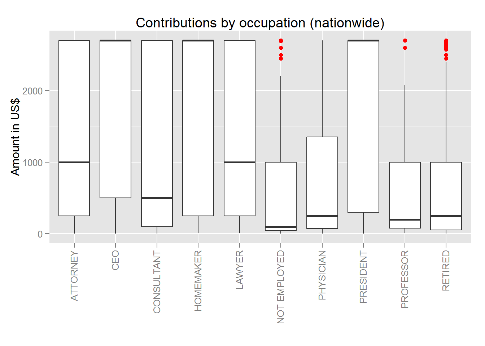
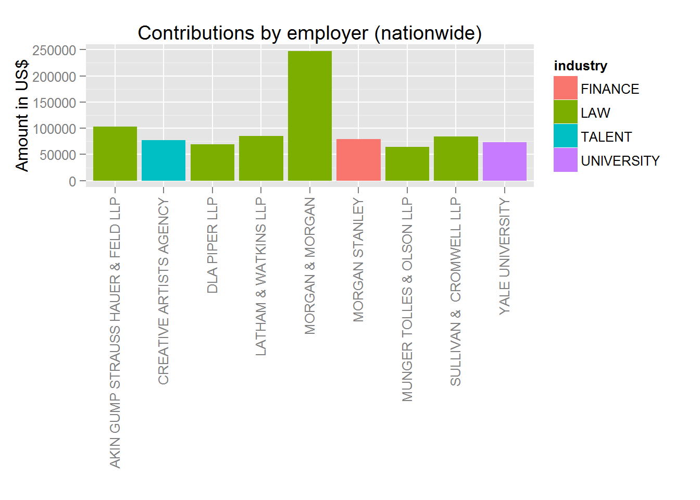
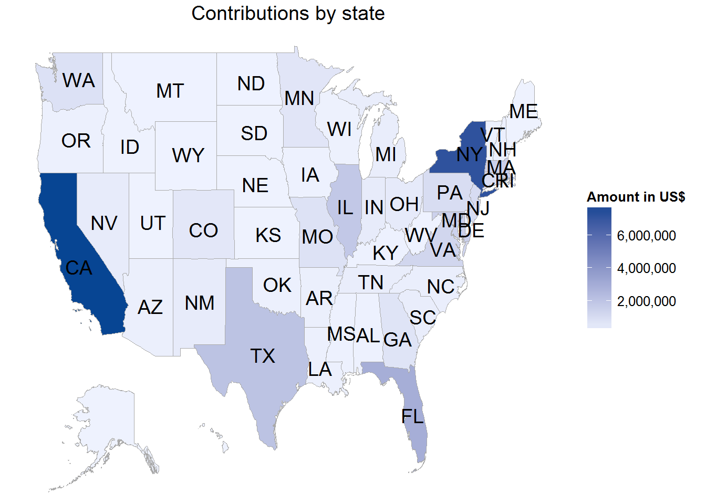
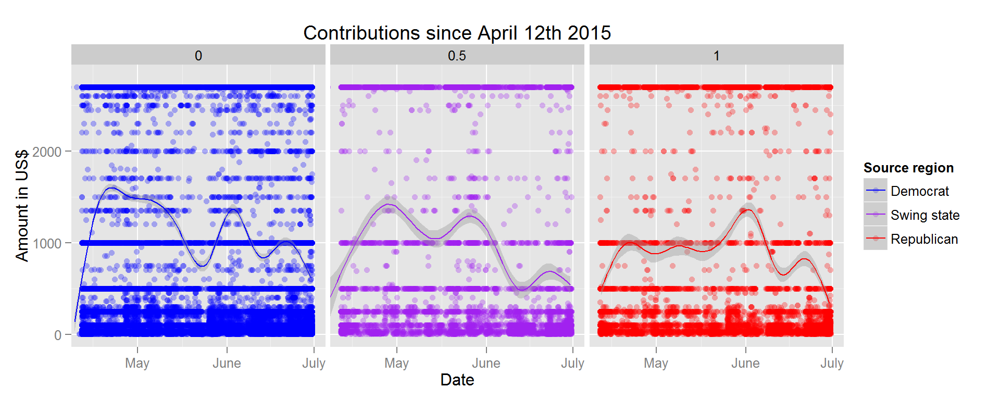

#Project 3: Ulaanbaatar OpenStreetMap Data Wrangling with MongoDB
In this project, I use data munging techniques, such as assessing the quality of the data for validity, accuracy, completeness, consistency and uniformity, to clean OpenStreetMap data for [Ulaanbaatar](https://en.wikipedia.org/wiki/Ulan_Bator), capital of Mongolia.

**Dataset:** [CSV from fec.gov](http://fec.gov/disclosurep/PDownload.do)
**Format:** ftp://ftp.fec.gov/FEC/Presidential_Map/2016/DATA_DICTIONARIES/CONTRIBUTOR_FORMAT.txt

_See Knittr `hillary_2015-contribs.Rmd` and `hillary_2015-contribs.html` for detailed analysis._

##Final plots and summary

Exploratory Data Analysis of the Hillary Rodham Clinton 2016 campaign from April to July 2016 identified several avenues for further investigation.

###1. Contributions by occupation (nationwide)

The average contributions to the campaign differ substantially across occupations.

The retired, unemployed, professors and physicians all have very low median contributions, with some outliers in the $2000-2700 range.

CEOs, homemakers and presidents have a median equal to the contribution limit. Attorneys, lawyers, and consultants do not make high median contributions but there is very significant variance. This is likely because some of these contributors are employed by major law and consulting firms who may even endorse and cover their contributions, whereas others are part of a smaller partnership and cover the contribution out of pocket.

The variance may also be indicative of the U-shaped [distribution of salaries in the legal professions](http://qph.is.quoracdn.net/main-qimg-0a0d8f37efe16a83e4f1208aea3b1988?convert_to_webp=true).

###2. Contributions by employer (nationwide)

This chart makes it especially clear where a lot of the money flows from. The largest donor is Morgan & Morgan, a consumer protection and personal injury law firm. Most of the other donors are also legal firms, with the exception of one talent agency, one financial institution and one Ivy League university.

Given that some of the top donors in the 2012 Obama campaign (Source: https://www.opensecrets.org/pres12/) were major universities, I would have expected to see more purple in the list. I'm also surprised to see Morgan Stanley, one of the top donors in the 2012 Mitt Romney campaign (ibid.). Of course, it is impossible to say whether Morgan Stanley doesn't have an equal, or even larger stake in campaigns of GOP candidates without analysis of the entire dataset.

###3. Contributions by state

The choropleth map of total amount of contributions by state is largely unsurprising, with one exception.

Why is Texas, a predominantly Republican state, one of the top sources of contributions for Hillary Clinton?

I tried to investigate this question by exploring contributions by employer using a Texas subset of the data, but discovered no easy explanation.

It may be worthwhile to explore the Texas subset further, at a more granular level, mapping contributions by ZIP code.

###4. Contribution time series

Plotting contributions from April 1st till July 1st, gives us yet another perspective on the data. 

Contributions appear to be remarkably consistent. A an increase in small contributions (< $250) can be observed in the last few months. This could be seasonal, or a natural evolution as the electoral cycle progresses.

Although the median contributions are consistently higher from Democrat states, the difference isn’t very large. Of note are the last two weeks of May, when median Republican and swing state contributions were higher than those from Democrat states.

##Reflection
The Hillary 2016 campaign contributions dataset contains over 38,000 entrie from April till July 2015. Although the elections are still far away, analysis of existing data can give us some indication of most important contribution sources, and allows us to predict the demographics Hillary Clinton should approach as her fundraising progresses.

I started by understanding the individual variables by studying the [official dataset format](ftp://ftp.fec.gov/FEC/Presidential_Map/2016/DATA_DICTIONARIES/CONTRIBUTOR_FORMAT.txt), then conducting basic descriptive statistical analysis.

To begin with, I chose to omitt all entries above the [$2700 contribution limit](http://www.fec.gov/pages/fecrecord/2015/february/contriblimits20152016.shtml) as they break the [Federal Election Campaign Act](http://www.fec.gov/law/feca/feca.pdf) and thus were or will be refunded.

I then used these findings and my domain expertise to explore contribution numbers and amounts across a number of variables including occupation, employer, and state.

Some findings where not surprising. Contributions to Hillary's campaign tend to come from California and the city of New York, they tend to be made by the retired, and law firms are some of the major employers behind these contributors.

Other findings were more surprising, however:

* Physicians, who are [among the best paid in the country](http://www.bls.gov/oes/current/oes_nat.htm),  make very small contributions compared to other occupations.

* Texas, a [predominantly Republican state](https://en.wikipedia.org/wiki/Politics_of_Texas), is among the top 10 sources of contributions to Hillary Clinton's campaign.

* The self-employed are clearly, by far, the largest contributors to Hillary Clinton's campaign. This is surprising, given that the self-employed traditionally vote GOP. Of course, without analysis of all contributions in this electoral cycle, it is impossible to tell whether an even larger number of self-employed Americans contribute to Republican candidates, as one would expect, given that Republicans are roughly 50% more likely to be self-employed (Fried, pp. 104–5, 125.)

It would be most interesting to explore this dataset further by combining it with data from Hillary Clinton's 2008 presidential campaign. Have Hillary's contribution sources changed since 8 years ago? Could we predict current and future contributors using data from previous elections? These are all important questions that could be studied using a combined dataset.